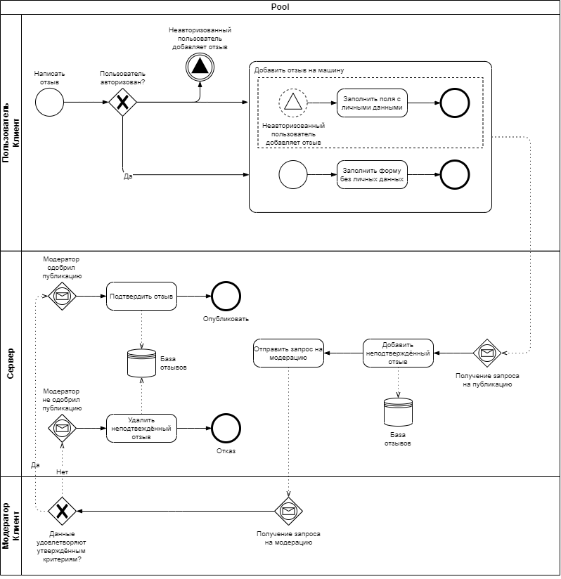
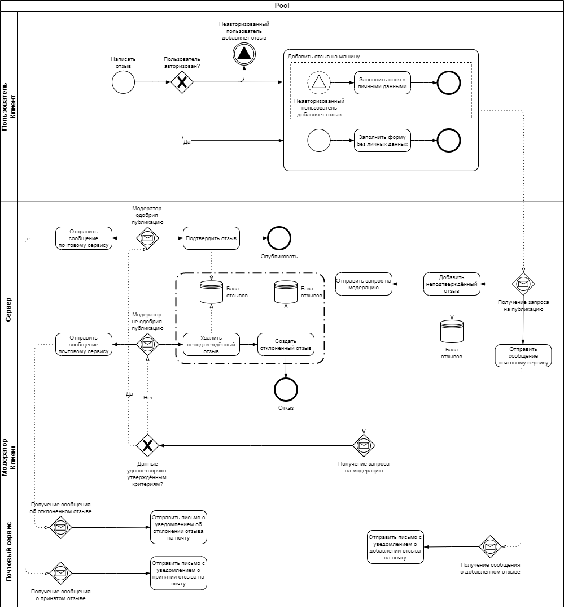

<h1>Лабораторные работы по Бизнес-логике программных систем</h1>

<i>Каждая лабораторная отражена в истории коммитов, и для её просмотра нужно отобразить репозиторий с соответсвующей
точки.</i>

Документация коллекции запросов в Postman [здесь](https://documenter.getpostman.com/view/18954461/UVkjuwx9)

<h2>Лабораторная работа №1</h2>

<h4>Вариант №4009: Автомобильный сайт Wroom.ru - http://wroom.ru/ </h4>

Описать бизнес-процесс в соответствии с нотацией BPMN 2.0, после чего реализовать его в виде приложения на базе Spring
Boot.

<h3>Порядок выполнения работы:</h3>

* Выбрать один из бизнес-процессов, реализуемых сайтом из варианта задания.
* Утвердить выбранный бизнес-процесс у преподавателя.
* Специфицировать модель реализуемого бизнес-процесса в соответствии с требованиями BPMN 2.0.
* Разработать приложение на базе Spring Boot, реализующее описанный на предыдущем шаге бизнес-процесс. Приложение должно
  использовать СУБД PostgreSQL для хранения данных, для всех публичных интерфейсов должны быть разработаны REST API.
* Разработать набор curl-скриптов, либо набор запросов для REST клиента Insomnia для тестирования публичных интерфейсов
  разработанного программного модуля. Запросы Insomnia оформить в виде файла экспорта.
* Развернуть разработанное приложение на сервере helios.

<h2>Лабораторная работа №2</h2>

Доработать приложение из лабораторной работы #1, реализовав в нём управление транзакциями и разграничение доступа к
операциям бизнес-логики в соответствии с заданной политикой доступа.

<h3>Управление транзакциями необходимо реализовать следующим образом:</h3>

* Переработать согласованные с преподавателем прецеденты (или по согласованию с ним разработать новые), объединив
  взаимозависимые операции в рамках транзакций.
* Управление транзакциями необходимо реализовать с помощью Spring JTA.
* В реализованных (или модифицированных) прецедентах необходимо использовать программное управление транзакциями.
* В качестве менеджера транзакций необходимо использовать Java EE JTA, предварительно преобразовав приложение в war,
  развёртываемый на сервере приложений WildFly.

<h3>Разграничение доступа к операциям необходимо реализовать следующим образом:</h3>

* Разработать, специфицировать и согласовать с преподавателем набор привилегий, в соответствии с которыми будет
  разграничиваться доступ к операциям.</h3>
* Специфицировать и согласовать с преподавателем набор ролей, осуществляющих доступ к операциям бизнес-логики
  приложения.
* Реализовать разработанную модель разграничений доступа к операциям бизнес-логики на базе Spring Security. Информацию
  об учётных записах пользователей необходимо сохранять в реляционую базу данных, для аутентификации использовать JWT.

<h2>Лабораторная работа №3</h2>

Доработать приложение из лабораторной работы #2, реализовав в нём асинхронное выполнение задач с распределением
бизнес-логики между несколькими вычислительными узлами и выполнением периодических операций с использованием
планировщика задач.

<h3>Требования к реализации асинхронной обработки:</h3>

* Перед выполнением работы неободимо согласовать с преподавателем набор прецедентов, в реализации которых целесообразно
  использование асинхронного распределённого выполнения задач. Если таких прецедентов использования в имеющейся
  бизнес-процесса нет, нужно согласовать реализацию новых прецедентов, доработав таким образом модель бизнес-процесса из
  лабораторной работы #1.
* Асинхронное выполнение задач должно использовать модель доставки "очередь сообщений".
* В качестве провайдера сервиса асинхронного обмена сообщениями необходимо использовать очередь сообщений на базе
  RabbitMQ.
* Для отправки сообщений необходимо использовать протокол AMQP 0-9-1. Библиотеку для реализации отправки сообщений можно
  взять любую на выбор студента.
* Для получения сообщений необходимо использовать JMS API.

<h3>Требования к реализации распределённой обработки:</h3>

* Обработка сообщений должна осуществляться на двух независимых друг от друга узлах сервера приложений.
* Если логика сценария распределённой обработки предполагает транзакционность выполняемых операций, они должны быть
  включены в состав распределённой транзакции.

<h3>Требования к реализации запуска периодических задач по расписанию:</h3>

* Согласовать с преподавателем прецедент или прецеденты, в рамках которых выглядит целесообразным использовать
  планировщик задач. Если такие прецеденты отсутствуют -- согласовать с преподавателем новые и добавить их в модель
  автоматизируемого бизнес-процесса.
* Реализовать утверждённые прецеденты с использованием планировщика задач Quartz.

